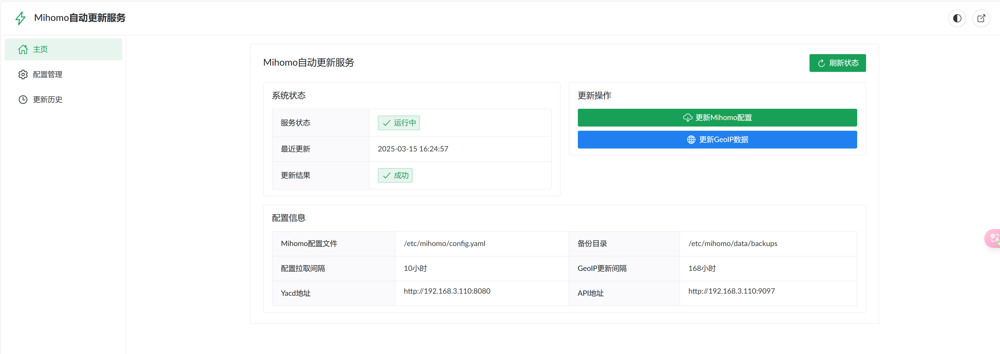

# Mihomo自动更新服务

<p align="center">
  
</p>

<p align="center">
  一个用于自动更新Mihomo（Clash.Meta）配置文件和GeoIP数据的服务，具有美观的Web界面管理。
</p>

## 📝 项目简介

Mihomo自动更新服务是一个专为Mihomo（原Clash.Meta）用户设计的自动化工具，可以帮助用户自动更新订阅配置和地理位置数据，并提供美观的Web界面进行管理。

### 主要功能

- ✅ 自动定期从指定URL拉取最新的Clash配置文件
- ✅ 智能合并配置文件，只更新`proxies`、`proxy-groups`、`rules`部分
- ✅ 自动备份原配置文件，定期更新GeoIP数据
- ✅ 提供美观的响应式Web界面，支持一键跳转到Yacd面板
- ✅ 支持从本地YAML文件导入配置

## 🖼️ 界面预览

<p align="center">
  
</p>

## 🚀 快速开始

### Docker部署（推荐）

```bash
# 克隆仓库
git clone https://github.com/zztdandan/mihomo-updater.git
cd mihomo-updater

# 构建镜像
docker-compose -f build/docker-compose.build.yml build

# 启动服务
docker-compose -f build/docker-compose.yml up -d
```

### 访问界面

- Web管理界面: `http://your-server-ip:3000`
- Yacd控制面板: `http://your-server-ip:8080`

## 📋 更新日志

### 最新版本 (2025-04-04)

#### ✨ 界面优化更新 (02e5f34)
- 全面优化了所有界面设计，提供更友好的移动端支持
- 升级了首页信息展示方式，采用更现代的卡片式布局
- 优化了配置和历史页面的响应式设计，适配不同设备屏幕

#### 🛠️ 构建系统优化 (9b43f9b)
- 改进了Docker打包编译流程
- 修复了ignore文件配置错误，确保关键构建文件不被忽略
- 改进了容器时区设置，统一使用Asia/Shanghai时区

#### 🔄 功能增强 (25e3354)
- 新增本地YAML配置文件导入功能
- 优化了配置更新流程，支持从本地文件更新系统
- 添加了激活脚本，优化开发环境配置

## ✅ TODO 计划

### 近期计划
- [ ] 增加多配置切换功能，支持多个配置文件管理
- [ ] 增加配置模板功能，方便用户快速创建新配置
- [ ] 增加自定义规则编辑器，可视化编辑规则

### 长期计划
- [ ] 增加配置测速功能，自动选择最优节点
- [ ] 提供更详细的流量统计与分析功能
- [ ] 支持更多代理协议和配置格式
- [ ] 增加用户系统，支持多用户管理不同配置

## 📖 详细文档

- [详细安装和使用指南](docs/detailed-guide.md)
- [Docker部署指南](docs/docker-guide.md)
- [前端开发文档](docs/frontend.md)

## 🧰 项目结构

```
mihomo-updater/
├── frontend/             # 前端Vue代码
├── backend/              # 后端Python代码
├── build/                # 打包与部署配置
├── data/                 # 数据存储目录
└── docs/                 # 详细文档
```

## 🔧 技术栈

- 前端：Vue 3 + TypeScript + Naive UI
- 后端：Python + Flask
- 部署：Docker + Docker Compose

## 📄 许可证

MIT

## 🤝 贡献

欢迎提交问题和贡献代码！请查看[贡献指南](docs/contributing.md)。

## 📣 致谢

- [Mihomo](https://github.com/MetaCubeX/mihomo) - 本项目服务的核心组件
- [Yacd](https://github.com/haishanh/yacd) - 优秀的Clash Web控制面板 